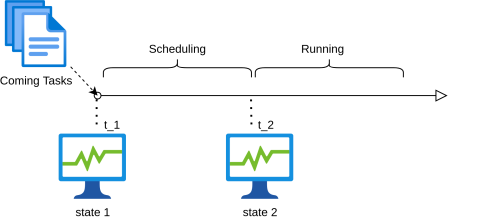

# Bayesian Network Application To Task Scheduling In Cloud Environment
*This is my graduation project, researching task scheduling algorithms in the cloud computing environment.*

***Content***  
    - *data-exploration*: explore and analyze experiment data  
    - *datacenter-simulation*: simulation program to assess task scheduling algorithm performences.  
    - *related-materials*: the related papers  
    - *reports*: all reports  

## Description
My career orientation is to become a data scientist, so in this project, I tried to solve real-time task scheduling problem via a statistical power - **Bayesian Network**.  
Bayesian Network is a type of probabilistic graphical models, and it strongly supports to answer statistical queries about stochastic events. Due to this power, I constructed a network representing uncertain elements of the cloud system to estimate the expectation of their states. 

## Main Work

### *Resources state differences between scheduling time and executing time*
At t1, tasks which are waiting in queue are scheduled. The scheduling period lasts to t2.

  

After scheduling period, the state of system changes from *state1* to *state2*. However, scheduler processed *state1* which is changed, therefore the result of scheduling possibly is unoptimized.  
To investigate the impacts of the changes, I conducted an experiment to compare performence between case that *state1* is similar to *state2*, and case that *state1* is different to *state2*.  

  

We can see that the execution time average of the second case is 5.72, in comparison to 4.78 of the first case. Moreover, after pvalue computed equals to 0.013, with 5% significance, I conclude that the state change after scheduling time makes the scheduling solution worse.  

### Solution
To address this problem, at t1, I use a Bayesian Network to estimate *state2* at executing time, then use the result to match virtual machines with tasks.  
For more information about algorithms, please see my thesis in *reports* folder. 

## Experiment Result

### General Metrics
I use the execution time average and the number of finished tasks in 1000s simulation to assess the performence of a algorithm.  
*** Number of tasks finished ***

| Statistics | Number of tasks finished |
| ----------- | ----------- |
| First-Come-First-Serve | 13214 |
| Worstfit | 13925 |
| My solution | 14235 |

We can see that my solution finished more tasks in 1000s than the two others.

*** Execution time average *** 

| Statistics | Execution Time Average |
| ----------- | ----------- |
| First-Come-First-Serve | 10.62 |
| Worstfit | 6.34 |
| My solution | 5.42 |

Further more, the average of execution time of my solution is also better than FCFS and Worstfit.

### Bayesian Network's Performence 

  

In the figure above, the blue line is represented for real available resources at execution time, red line for available resources estimated by bayesian network, purple line for no-estimated available resources at scheduling time.  
We see that the gap between purple line and blue line is much large than red line, meaning that the estimation of bayesian network is better than no-estimated information. 

## Conclusion 

My project have two main conclusion: 
- The state changes have negative impacts on scheduling solution. 
- State estimation can improve scheduling solution to adapt to the state changes. 

